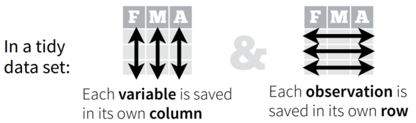

```{r setup, include=FALSE}
knitr::opts_chunk$set(echo = TRUE, results = 'hide')
options(htmltools.dir.version = FALSE)
#options(crayon.enabled = TRUE)
library(emo)

```


layout: true
  
<div class="my-header"></div>

<div class="my-footer"><span>Cécile SAUDER    
&emsp;&emsp;&emsp;&emsp;&emsp;&emsp;&emsp;&emsp;&emsp;&emsp;&emsp;&emsp;&emsp;
&emsp;&emsp;&emsp;&emsp;&emsp;&emsp;&emsp;&emsp;&emsp;&emsp;&emsp;&emsp;
30-31 janvier 2020</span></div> 


---

background-image: url(https://github.com/rstudio/hex-stickers/raw/master/SVG/tidyverse.svg?sanitize=true)
background-size: 550px
background-position: 50% 50%


---


<br> <br> <br> <br>   


1. Présentation Tidyverse et tidy data    

2. Importer les données (readr, haven, readxl)    

3. Ceci n'est pas un pipe (magrittr)    

4. Programmation fonctionnelle  (purrr)    

5. Manipuler les données (dplyr, tidyr, tibble)    

6. Transformer et nettoyer (forcats, stringr, lubridate)    

7. Modéliser (broom)    

8. Communiquer (rmarkdown, blogdown, xaringan, shiny)    


---

background-image: url(https://github.com/rstudio/hex-stickers/raw/master/SVG/tidyverse.svg?sanitize=true)
background-size: 90px
background-position: 97% 3%


<div class="my-footer"><span> <b>1. Présentation Tidyverse et tidy data  </b>   
</span></div> 


# [www.tidyverse.org](www.tidyverse.org)

1. Installer et charger le `tidyverse` `r emo::ji("package")`  


```{r}

#install.packages("tidyverse")

library(tidyverse)

```
  
  
<br> 

  
```{r, echo=FALSE , results='markup'}


knitr::include_graphics("img/tidyband.png")

```

---

background-image: url('img/Tidyverse.png')
background-size: 900px
background-position: 65% 45%

<div class="my-footer"><span> <b>1. Présentation Tidyverse et tidy data  </b>   
</span></div> 

---

background-image: url(https://media.giphy.com/media/FHEjBpiqMwSuA/giphy.gif)
background-size: 400px
background-position: 85% 25%


<div class="my-footer"><span> <b>1. Présentation Tidyverse et tidy data  </b>   
</span></div> 

# Tidy data

```{r echo=FALSE, out.width = "250px", results='markup'}

knitr::include_graphics("img/wickham_president.jpg")

```

--





---


<div class="my-footer"><span> <b>1. Présentation Tidyverse et tidy data  </b>   
</span></div> 

# Data

Extrait du jeu de données [**gapminder**](https://www.gapminder.org/) ([**video ted**](https://www.gapminder.org/videos/ted-us-state-department/))

1. Installer et charger le `gapminder` `r emo::ji("package")`   
2. Regarder le jeu de données gapminder (Est-il tidy ?)

--

```{r, results='markup'}
#install.packages(gapminder)

library(gapminder)

gapminder

```

---

background-image: url(https://github.com/rstudio/hex-stickers/raw/master/SVG/readr.svg?sanitize=true)
background-size: 90px
background-position: 97% 3%


<div class="my-footer"><span> <b>2. Importer des données  </b>   
</span></div> 

# Import

read_csv (,)   
read_csv2 (;)    
read_delim (?)


<br>


```{r, results='markup'}

gapminder_bis <- read_csv("data/ratio_of_girls_to_boys_in_primary_and_secondary_education_perc.csv")

```


---

background-image: url(https://github.com/rstudio/hex-stickers/raw/master/SVG/readxl.svg?sanitize=true)
background-size: 90px
background-position: 97% 3%

<div class="my-footer"><span> <b>2. Importer des données  </b>   
</span></div> 

# Import

<br> <br>

```{r, results='markup'}

#install.package("readxl)

library(readxl)

gapminder_bis <- read_xlsx("data/ratio_of_girls_to_boys_in_primary_and_secondary_education_perc.xlsx")


```

---

background-image: url(https://github.com/rstudio/hex-stickers/raw/master/SVG/tibble.svg?sanitize=true)
background-size: 90px
background-position: 97% 3%

<div class="my-footer"><span> <b>2. Importer des données  </b>   
</span></div> 

# Tibble


```{r, results='markup'}

gapminder_bis

```


---

background-image: url(https://github.com/rstudio/hex-stickers/raw/master/SVG/tibble.svg?sanitize=true)
background-size: 90px
background-position: 97% 0.1%

<div class="my-footer"><span> <b>2. Importer des données  </b>   
</span></div> 

# Tibble vs data.frame


```{r, results='markup'}

as.data.frame(gapminder_bis)

```


---


background-image: url(https://github.com/rstudio/hex-stickers/raw/master/SVG/tibble.svg?sanitize=true)
background-size: 90px
background-position: 97% 3%

<div class="my-footer"><span> <b>2. Importer des données  </b>   
</span></div> 

# Tibble vs data.frame


```{r, results='markup'}

head(as.data.frame(gapminder_bis), 3)

```


---

background-image: url(https://github.com/rstudio/hex-stickers/raw/master/SVG/pipe.svg?sanitize=true)
background-size: 90px
background-position: 97% 3%


<div class="my-footer"><span> <b>3. Ceci n'est pas un pipe  </b>   
</span></div> 

# Pipe data


.pull-left[

- old way : **verb(subject, complements)**  

```{r}
head(as.data.frame(gapminder_bis), 3)
```

.center[ ]

]

--

- pipe way : **subject %>% verb(complements)**

```{r}
gapminder_bis %>% 
  as.data.frame() %>%
  head(3)
```

.center[]


---


background-image: url(https://github.com/rstudio/hex-stickers/raw/master/SVG/pipe.svg?sanitize=true)
background-size: 90px
background-position: 97% 3%


<div class="my-footer"><span> <b>3. Ceci n'est pas un pipe  </b>   
</span></div> 

# Pipe data


Reprendre le code précédent et exporter le résultat en csv : 
  1. Sans '%>%'

  
--

 - `r emo::ji("bulb")` : `write_csv()`  
  
--

```{r, eval=FALSE}
write_csv2(head(as.data.frame(gapminder_bis), 3), "tableau.csv")
```

--

<br> 

  2. Avec des '%>%'
  
--
  
```{r, eval=FALSE}
gapminder_bis %>% 
  as.data.frame() %>%
  head(3) %>%
  write_csv2("tableau.csv")
```

---

<div class="my-footer"><span> <b>4. Transformer des données  </b>   
</span></div> 

# Data


```{r, results='markup'}
gapminder
```


---

<div class="my-footer"><span> <b>4. Transformer des données  </b>   
</span></div> 

# Data


```{r, results='markup'}
gapminder_bis
```


---

background-image: url(https://github.com/rstudio/hex-stickers/raw/master/SVG/tidyr.svg?sanitize=true)
background-size: 90px
background-position: 97% 3%

<div class="my-footer"><span> <b>4. Transformer des données  </b>   
</span></div> 

# Reshape


1. Transformer `gapminder_bis` pour pouvoir le joindre à `gapminder`

--

 - `r emo::ji("bulb")` : 
      - gather => pivot_longer
      - spread => pivot_wider

--

```{r, results='markup'}
gapminder_bis %>%
  gather(key = year,  
         value = "ratio_girls_to_boys", 
         -country, 
         na.rm = TRUE)
```


---

background-image: url(https://github.com/rstudio/hex-stickers/raw/master/SVG/tidyr.svg?sanitize=true)
background-size: 90px
background-position: 97% 3%

<div class="my-footer"><span> <b>4. Transformer des données  </b>   
</span></div> 

# Reshape

1. Transformer `gapminder_bis` pour pouvoir le joindre à `gapminder`

 - `r emo::ji("bulb")` : 
      - gather => pivot_longer
      - spread => pivot_wider


```{r, results='markup'}
gapminder_bis %>%
  pivot_longer(-country, 
               names_to = "year", 
               values_to = "ratio_girls_to_boys", 
               values_drop_na = TRUE)
```


---

background-image: url(https://github.com/rstudio/hex-stickers/raw/master/SVG/tidyr.svg?sanitize=true)
background-size: 90px
background-position: 97% 3%

<div class="my-footer"><span> <b>4. Transformer des données  </b>   
</span></div> 

# Reshape

1. Transformer `gapminder_bis` pour pouvoir le joindre à `gapminder`

 - `r emo::ji("bulb")` : 
      - gather => pivot_longer
      - spread => pivot_wider


```{r, results='markup'}
gapminder_ratio <- gapminder_bis %>%
  pivot_longer(-country, 
               names_to = "year", 
               values_to = "ratio_girls_to_boys", 
               values_drop_na = TRUE)
```


---

background-image: url(https://github.com/rstudio/hex-stickers/raw/master/SVG/dplyr.svg?sanitize=true)
background-size: 90px
background-position: 97% 3%


<div class="my-footer"><span> <b>5. Manipuler les données  </b>   
</span></div> 

# Join

```{r,eval=FALSE, results='asis'}
gapminder %>%
  left_join(gapminder_ratio)
```
Erreur : Can't join on 'year' x 'year' because of incompatible types (character / integer)

```{r, results='markup'}
gapminder_ratio
```


---

background-image: url(https://github.com/rstudio/hex-stickers/raw/master/SVG/dplyr.svg?sanitize=true)
background-size: 90px
background-position: 97% 3%


<div class="my-footer"><span> <b>5. Manipuler les données  </b>   
</span></div> 

# Modifier une colonne


```{r, results='markup'}
gapminder_ratio %>%
  mutate(year = as.integer(year))
```

---

background-image: url(https://github.com/rstudio/hex-stickers/raw/master/SVG/dplyr.svg?sanitize=true)
background-size: 90px
background-position: 97% 3%


<div class="my-footer"><span> <b>5. Manipuler les données  </b>   
</span></div> 

# Modifier une colonne


```{r, results='markup'}
gapminder_ratio <- gapminder_ratio %>%
  mutate(year = as.integer(year))
```


---


background-image: url(https://github.com/rstudio/hex-stickers/raw/master/SVG/dplyr.svg?sanitize=true)
background-size: 90px
background-position: 97% 3%


<div class="my-footer"><span> <b>5. Manipuler les données  </b>   
</span></div> 

# Left join

```{r, results='markup'}
gapminder %>%
  left_join(gapminder_ratio)
```


---


background-image: url(https://github.com/rstudio/hex-stickers/raw/master/SVG/dplyr.svg?sanitize=true)
background-size: 90px
background-position: 97% 3%


<div class="my-footer"><span> <b>5. Manipuler les données  </b>   
</span></div> 

# Right join

```{r, results='markup'}
gapminder %>%
  right_join(gapminder_ratio)
```


---


background-image: url(https://github.com/rstudio/hex-stickers/raw/master/SVG/dplyr.svg?sanitize=true)
background-size: 90px
background-position: 97% 3%


<div class="my-footer"><span> <b>5. Manipuler les données  </b>   
</span></div> 

# Inner join

```{r, results='markup'}
gapminder %>%
  inner_join(gapminder_ratio)
```


---


background-image: url(https://github.com/rstudio/hex-stickers/raw/master/SVG/dplyr.svg?sanitize=true)
background-size: 90px
background-position: 97% 3%


<div class="my-footer"><span> <b>5. Manipuler les données  </b>   
</span></div> 

# Full join

```{r, results='markup'}
gapminder %>%
  full_join(gapminder_ratio)
```


---

background-image: url(https://github.com/rstudio/hex-stickers/raw/master/SVG/dplyr.svg?sanitize=true)
background-size: 90px
background-position: 97% 3%


<div class="my-footer"><span> <b>5. Manipuler les données  </b>   
</span></div> 

# Join

```{r, results='markup'}
gapminder <- gapminder %>%
  left_join(gapminder_ratio)
```

---


background-image: url(https://github.com/rstudio/hex-stickers/raw/master/SVG/dplyr.svg?sanitize=true)
background-size: 90px
background-position: 97% 3%


<div class="my-footer"><span> <b>5. Manipuler les données  </b>   
</span></div> 

# Filter

1\. Filtrer les données pour l'année 1982
--

 - `r emo::ji("bulb")` : condition `==`  

--
```{r}
gapminder %>%
  filter(year == 1982)
```
--
2\. Filtrer les données pour l'Espagne en 2002
--

 - `r emo::ji("bulb")` : `&`  

--

```{r}
gapminder %>%
  filter(country == "Spain" & year == 2002)
```
---

background-image: url(https://github.com/rstudio/hex-stickers/raw/master/SVG/dplyr.svg?sanitize=true)
background-size: 90px
background-position: 97% 3%


<div class="my-footer"><span> <b>5. Manipuler les données  </b>   
</span></div> 

# Arrange

1\. Trier les données par population croissante (`pop`)

--

```{r}
gapminder %>%
  arrange(pop)
```

--

2\. Trier les données par population décroissante (`pop`)

--

 - `r emo::ji("bulb")` : `desc()`

--

```{r}
gapminder %>%
  arrange(desc(pop))
```

--

3\. Filtrer les données pour la `France` et les trier par espérance de vie décroissante `lifeExp`

--

```{r}
gapminder %>%
  filter(country == "France") %>%
  arrange(desc(lifeExp))
```


---

background-image: url(https://github.com/rstudio/hex-stickers/raw/master/SVG/dplyr.svg?sanitize=true)
background-size: 90px
background-position: 97% 3%


<div class="my-footer"><span> <b>5. Manipuler les données  </b>   
</span></div> 

# Mutate

1\. Créer deux nouvelles colonnes, une appelée `popMil` avec la population en million
et l'autre appelée `lifeExpMonths` avec l'espérance de vie en mois.

--

 - `r emo::ji("bulb")` 1 : `pop / 100000` , `lifeExp * 12`

--

 - `r emo::ji("bulb")` 2 : on peut créer plusieurs colonnes dans le même `mutate()`
 
--
```{r}
gapminder %>%
  mutate(popMil = pop / 1000000,
         lifeExpMonths = lifeExp * 12)
```

---

background-image: url(https://github.com/rstudio/hex-stickers/raw/master/SVG/dplyr.svg?sanitize=true)
background-size: 90px
background-position: 97% 3%


<div class="my-footer"><span> <b>5. Manipuler les données  </b>   
</span></div> 

# Mutate 


2\. Créer une nouvelle colonne `popUnderMillion` avec deux groupes, l'un avec `TRUE` quand la population `pop` est inférieure à un million, et `FALSE` quand la population est supérieure ou égale à un million

--

 - `r emo::ji("bulb")` : use `if_else()`

--
```{r}
gapminder %>%
  mutate(
    popUnderMillion = if_else(
      pop < 1000000, 
      TRUE, 
      FALSE
    )
  )
```

---

background-image: url(https://github.com/rstudio/hex-stickers/raw/master/SVG/dplyr.svg?sanitize=true)
background-size: 90px
background-position: 97% 3%


<div class="my-footer"><span> <b>5. Manipuler les données  </b>   
</span></div> 

# Mutate 


3\. Créer une nouvelle colonne `lifeExpGroup` avec 3 groupes, `young` quand `lifeExp` est inférieur à 50, `middle` quand `lifeExp` est entre 50 et 70, et `old` quand c'est supérieur à 70

--

 - `r emo::ji("bulb")` : Pour plus de 2 cas, utiliser `case_when()`

--

```{r}
gapminder %>%
  mutate(
    lifeExpGroup = case_when(
      lifeExp < 50 ~ "young",
      lifeExp >= 50 & lifeExp <= 70 ~ "middle",
      lifeExp > 70 ~ "old",
      TRUE ~ NA_character_
    )
  )

```

---

background-image: url(https://github.com/rstudio/hex-stickers/raw/master/SVG/dplyr.svg?sanitize=true)
background-size: 90px
background-position: 97% 3%


<div class="my-footer"><span> <b>5. Manipuler les données  </b>   
</span></div> 


# Select

1\. Selectionner les continents `continent` et les pays `country`

--

 - `r emo::ji("bulb")` : On peut utiliser `starts_with("c")` (mais ce n'est pas la seule solution)

--

```{r}
gapminder %>%
  select(starts_with("c"))
```

ou

```{r}
gapminder %>%
  select(continent, country)
```

--

2\. Selectionner toutes les variables sauf l'espérance de vie `lifeExp`

--

```{r}
gapminder %>%
  select(-lifeExp)
```

---

background-image: url(https://github.com/rstudio/hex-stickers/raw/master/SVG/dplyr.svg?sanitize=true)
background-size: 90px
background-position: 97% 3%


<div class="my-footer"><span> <b>5. Manipuler les données  </b>   
</span></div> 

# Select

3\. Selectionner toutes les variables numériques

--

 - `r emo::ji("bulb")` : On peut utiliser `select_if()`

--

```{r}
gapminder %>%
  select_if(is.numeric)
```

iris %>% 
  purrr::keep(is.numeric) %>% 
  head(2)
  
iris %>%
  purrr::map_if(is.numeric, log) %>%
  head(2)

---

background-image: url(https://github.com/rstudio/hex-stickers/raw/master/SVG/dplyr.svg?sanitize=true)
background-size: 90px
background-position: 97% 3%


<div class="my-footer"><span> <b>5. Manipuler les données  </b>   
</span></div> 

# Summarise and group_by

1\. Trouver la moyenne `avg_lifeExp`, la standard deviation `sd_lifeExp` et le nombre de valeurs `n_values` de `lifeExp` par `continent`, puis trier le résultat par `avg_lifeExp` décroissante.

--

```{r, results='markup'}
gapminder %>%
  group_by(continent) %>%
  summarise(
    avg_lifeExp = mean(lifeExp),
    sd_lifeExp = sd(lifeExp),
    n_values = n()
    ) %>%
  arrange(desc(avg_lifeExp))
```

---

background-image: url(https://github.com/rstudio/hex-stickers/raw/master/SVG/dplyr.svg?sanitize=true)
background-size: 90px
background-position: 97% 3%


<div class="my-footer"><span> <b>5. Manipuler les données  </b>   
</span></div> 

# Summarise and group_by

2\. Trouver la moyenne de toutes les variables numériques

--

```{r, results='markup'}
gapminder %>%
  group_by(continent) %>%
  summarise_if(
    is.numeric,
    mean,
    na.rm=TRUE
    ) %>%
  arrange(desc(lifeExp))
```


---

background-image: url(https://github.com/rstudio/hex-stickers/raw/master/SVG/ggplot2.svg?sanitize=true)
background-size: 90px
background-position: 97% 3%

<div class="my-footer"><span> <b>7. Visualiser les données  </b>   
</span></div> 

# ggplot

Parfois vous savez quel graphe vous voulez, parfois non. 

Plusieurs sites pour vous aider à choisir un graphe : 

- [**From Data to Viz**](https://www.data-to-viz.com/)

- [**R Graph Gallery**](https://www.r-graph-gallery.com/)

- [**ggplot2 extensions**](https://www.ggplot2-exts.org/gallery/)

- [**plotly**](https://plot.ly/r/)  pour les graphes interactifs


---

background-image: url(https://github.com/rstudio/hex-stickers/raw/master/SVG/ggplot2.svg?sanitize=true)
background-size: 90px
background-position: 97% 3%

<div class="my-footer"><span> <b>7. Visualiser les données  </b>   
</span></div> 

# ggplot geom_boxplot


1\. Tracer les boxplots de `lifeExp` par `continent`

--

```{r, eval = FALSE}
gapminder %>%
  ggplot(aes(x = continent, y = lifeExp)) +
  geom_boxplot()
```

--

2\. Customizer votre graphe
  - Réordonner les boxplots avec `forcats::fct_reorder`
  - Colorer les boxplots avec `aes fill`
  - Modifier les noms des axes avec `labs()`
  - Inverser les axes du graphe avec `coord_flip`
  - Enlever la légende

  
--

```{r, eval = FALSE}
p <- gapminder %>%
  ggplot(aes(x = forcats::fct_reorder(continent, -lifeExp), 
             y = lifeExp, 
             fill = continent)) +
  geom_boxplot() +
  labs(x = "", y = "Life Expectancy") +
  coord_flip() +
  theme(legend.position = 'none')
```

---

background-image: url(https://github.com/rstudio/hex-stickers/raw/master/SVG/ggplot2.svg?sanitize=true)
background-size: 90px
background-position: 97% 3%

<div class="my-footer"><span> <b>7. Visualiser les données  </b>   
</span></div>

# ggplot geom_boxplot + plotly


```{r,  message = FALSE, eval=FALSE}
library(plotly)
ggplotly(p)
```

```{r, eval=FALSE, echo = FALSE}
pg <- ggplotly(p)
htmltools::save_html(pg, file="ggplotly.html")
```

<iframe src="ggplotly.html" width="800" height="500" scrolling="yes" seamless="seamless" frameBorder="0"> </iframe>


---

background-image: url(https://github.com/rstudio/hex-stickers/raw/master/SVG/ggplot2.svg?sanitize=true)
background-size: 90px
background-position: 97% 3%


<div class="my-footer"><span> <b>7. Visualiser les données  </b>   
</span></div> 

# ggplot geom_point


1\. Essayer de reproduire ce graphe

```{r, echo=FALSE, fig.height= 6, fig.width= 9}
gapminder %>%
  filter(year == 2002) %>%
  ggplot(aes(gdpPercap, lifeExp, size = pop, colour = country)) +
    geom_point(alpha = 0.7) +
    scale_colour_manual(values = country_colors) +
    scale_size(range = c(2, 12)) +
    scale_x_log10() +
    facet_wrap(~continent) +
    theme(legend.position = 'none') +
    labs(title = 'Year: 2002', x = 'GDP per capita', y = 'Life Expectancy')
```

---

background-image: url(https://github.com/rstudio/hex-stickers/raw/master/SVG/ggplot2.svg?sanitize=true)
background-size: 90px
background-position: 97% 3%


<div class="my-footer"><span> <b>7. Visualiser les données  </b>   
</span></div> 


# ggplot


`r emo::ji("bulb")`  : 

1\. Use the aes `size` and `color`

--

2\. Add `geom_point` with a transparancy parameter `alpha`

--

3\. Change x scale in log scale with `scale_x_log10`

--

4\. Adjust colors with `scale_colour_manual` and `country_colors`

--

5\. Adjust size points with `scale_size`

--

6\. Use `facet_wrap` to plot the continents separatly 

---

background-image: url(https://github.com/rstudio/hex-stickers/raw/master/SVG/ggplot2.svg?sanitize=true)
background-size: 90px
background-position: 97% 3%

<div class="my-footer"><span> <b>7. Visualiser les données  </b>   
</span></div> 

# ggplot


Code complet du graphe : 

```{r, eval=FALSE}
gapminder %>%
  filter(year == 2002) %>%
  ggplot(aes(gdpPercap, lifeExp, size = pop, colour = country)) +
    geom_point(alpha = 0.7) +
    scale_colour_manual(values = country_colors) +
    scale_size(range = c(2, 12)) +
    scale_x_log10() +
    facet_wrap(~continent) +
    theme(legend.position = 'none') +
    labs(title = 'Year: 2002', x = 'GDP per capita', y = 'Life Expectancy')
```

---

background-image: url(https://github.com/thomasp85/gganimate/blob/master/man/figures/logo.png?raw=true)
background-size: 90px
background-position: 97% 3%

<div class="my-footer"><span> <b>7. Visualiser les données  </b>   
</span></div> 

# gganimate your ggplot

Animons le ggplot suivant les années. 

Ceci est un exemple du [**gganimate**](https://github.com/thomasp85/gganimate/wiki/Gapminder) `r emo::ji("package")` de [Thomas Lin Pedersen](https://twitter.com/thomasp85). 

Il est très facile d'animer le graphe précédent avec **gganimate**:

1\. Charger [**gganimate**](https://github.com/thomasp85/gganimate/wiki/Gapminder) `r emo::ji("package")`

2\. Copier le code du graphe précédent

3\. Modifier `title = 'Year: 2002'` en `title = 'Year: {frame_time}'` 

4\. Puis ajouter `+  transition_time(year)` 

---

background-image: url(https://github.com/thomasp85/gganimate/blob/master/man/figures/logo.png?raw=true)
background-size: 90px
background-position: 97% 3%


<div class="my-footer"><span> <b>7. Visualiser les données  </b>   
</span></div> 

# And TADAAAAAA

.center[ ]


---

background-image: url(https://github.com/rstudio/hex-stickers/raw/master/SVG/shiny.svg?sanitize=true)
background-size: 90px
background-position: 97% 3%

<div class="my-footer"><span> <b>9. Communiquer  </b>   
</span></div> 

# Shiny


---

background-image: url(https://github.com/rstudio/hex-stickers/raw/master/SVG/rmarkdown.svg?sanitize=true)
background-size: 90px
background-position: 97% 3%

<div class="my-footer"><span> <b>9. Communiquer  </b>   
</span></div> 

# Rmarkdown


---

background-image: url(https://github.com/rstudio/hex-stickers/raw/master/SVG/blogdown.svg?sanitize=true)
background-size: 90px
background-position: 97% 3%

<div class="my-footer"><span> <b>9. Communiquer  </b>   
</span></div> 


# Blogdown

---

background-image: url(https://user-images.githubusercontent.com/163582/45438104-ea200600-b67b-11e8-80fa-d9f2a99a03b0.png)
background-size: 90px
background-position: 97% 3%

<div class="my-footer"><span> <b>9. Communiquer  </b>   
</span></div> 

# Xaringan


---


# Thanks!

- [**Cheat sheets**](https://www.rstudio.com/resources/cheatsheets/)  
- [**R Graph Gallery**](https://www.r-graph-gallery.com/) by [Yan Holtz](https://twitter.com/R_Graph_Gallery)
- [**ggplot2 extensions**](https://www.ggplot2-exts.org/gallery/) by [Daniel Emaasit](https://twitter.com/emaasit)


.center[]

Slides created via the R package [**xaringan**](https://github.com/yihui/xaringan) with the [**R-Ladies theme**](https://github.com/rladies/resources/blob/master/xaringan-slides/how_to_use.md) 

